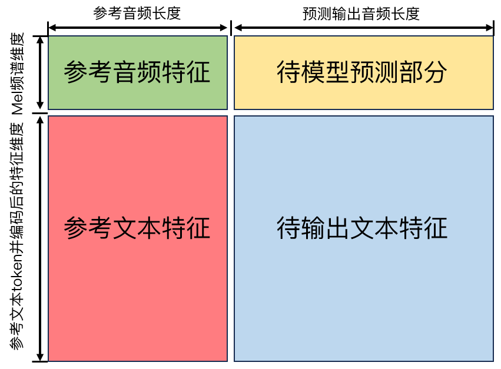

# F5加速推理与声音处理

## TTS 是什么？

它的英文全称是 ​Text-to-Speech，翻译过来就是 ​文字转语音。它的目标很简单：​让电脑或手机把你输入的文字，用像人一样自然的声音“读”出来。​​

​TTS 算法就是实现这个目标的技术方法。​​

可以把 TTS 想象成一个特别聪明的“声音魔法师”：

1. ​输入：​​ 你给它一段文字（比如“今天天气真好”）。
2. 处理：​​ 它施展各种算法“魔法”。
3. ​输出：​​ 它就输出一段清晰、自然、像人说话的语音（音频）。

### 这个“魔法”是怎么变的呢？（现代主流方法的简化版）：​​

1. 理解文字（文本分析和前端处理）：​​
    + 任务：​​ 弄清楚文字该怎么读。理解字词、句子结构、甚至情绪。
    + ​做法：​​
        + 分词：​​ 把句子拆分成词语（“今天”、“天气”、“真好”）。
        + 字音转换：​​ 把文字变成拼音或者更小的发音单位（音素）。
        + 多音字处理：​​ 判断“行”字在这里是读 “háng” 还是 “xíng”。
        + 语法和重音：​​ 分析句子结构，确定哪里该停顿、哪里重读、语调是升还是降。
        + 韵律和情感预测：​​ 预测这段话应该是高兴、悲伤、平静还是急促的？语速如何？
2. 生成声音的特征（声学模型 / 合成模型）：​​
    + 任务：​​ 根据第一步的分析结果，预测出声音的“骨架”——关键的声音特征参数（比如：基频/音高、时长、能量/响度、声谱特征等）。
    + 做法（现代主流）：​​ 使用深度神经网络（如 Tacotron, FastSpeech, VITS）​。这个网络被“训练”过很多遍：
        + 学习材料：​​ 给它大量的 “文字（标注了发音）” + “对应的真人高质量录音” 配对数据。
        + 学习目标：​​ 让网络学会看到这段文字时，预测出最像对应真人录音的声音特征参数。
        + 特点：​​ 能学到非常自然的语音变化和韵律。
3. ​合成最终的声音（声码器 / 波形生成）：​​
    + 任务：​​ 把第二步生成的“声音特征参数”，还原成人耳朵能听到的实际声音波形（.wav, .mp3 等文件）​。
    + 做法（现代主流）：​​ 同样使用深度神经网络（如 WaveNet, WaveRNN, HiFi-GAN, Vocos）​。
        + 学习材料：​​ 给它大量的 “声音特征参数” + “对应的原始声音波形” 配对数据。
        + 学习目标：​​ 让网络学会根据声音特征参数，精确地重建出清晰、自然、接近人耳原始录音的声音。
        + 特点：​​ 能生成非常清晰、自然的语音，几乎可以以假乱真。

### 总结一下现代 TTS 算法：​​

1. ​核心思想：​利用强大的深度神经网络，直接从大量的“文本-语音”配对数据中学习说话的能力。
2. 关键进步：​
    + ​更自然：​​ 合成的语音听起来更像真人，抑扬顿挫更自然（像人在说话，不像机器人念稿）。
    + 更灵活：​​ 可以模拟不同的说话人（声音克隆）、不同的情感语调。
    + 更高效：​​ 训练和合成速度越来越快。

## 实现 TTS 需要准备什么？

1. 显卡：考虑到后期加速需要，建议选择支持12.x驱动的N卡，一般是30系起步。
2. 系统：Linux系统
3. 环境：预装了Anaconda，显卡驱动，CUDA
    + [安装Anaconda教程](https://blog.csdn.net/wyf2017/article/details/118676765)
    + [安装显卡驱动教程](https://blog.csdn.net/zataji/article/details/123104569)
    + [安装CUDA](https://blog.csdn.net/Sihang_Xie/article/details/127347139)
    > **注意：** CUDA版本选择由本机驱动决定，本机驱动向下兼容CUDA，12.1的驱动可以装11.8的CUDA，但是不能装12.4
4. 模型：我们选择的是F5，后期会对模型进行加速处理。

## 原始的F5是什么？

2024年10月8日，上海交通大学团队发布，F5-TTS (A Fairytaler that Fakes Fluent and Faithful Speech with Flow Matching) 是一款基于扩散Transformer和ConvNeXt V2的文本转语音 (TTS) 模型。F5-TTS旨在生成流畅且忠实的语音，其训练速度和推理速度都得到了提升。 项目还提供了一个名为E2 TTS的模型，它是论文中模型的更接近的复现版本，基于Flat-UNet Transformer。 预训练模型已发布在Hugging Face和Model Scope上。

总而言之，F5-TTS是一个功能强大且易于使用的TTS模型，它结合了扩散模型和流匹配技术，实现了快速训练、快速推理和高质量的语音生成。 其提供的Gradio应用和CLI工具也方便了用户的使用。 项目文档较为完善，方便用户快速上手。

[GitHub地址](https://github.com/SWivid/F5-TTS)

[论文地址](https://arxiv.org/abs/2410.06885)

## F5 加速实现

基本的思路就是先将 `F5-TTS` 用 `ONNX` 导出，然后使用 `Tensorrt-LLM` 对有关 `Transformer` 部分进行加速。

### Install

```bash
conda create -n f5_tts_faster python=3.10 -y
source activate f5_tts_faster
```

```bash
conda install pytorch==2.5.0 torchvision==0.20.0 torchaudio==2.5.0 pytorch-cuda=12.4 -c pytorch -c nvidia -y
```

#### F5-TTS 环境

```bash
# huggingface-cli download --resume-download SWivid/F5-TTS --local-dir ./F5-TTS/ckpts
git clone https://github.com/SWivid/F5-TTS.git   # 0.3.4
cd F5-TTS
pip install -e . -i https://pypi.tuna.tsinghua.edu.cn/simple
```

```bash
# 修改源码加载本地的 vocoder
vim /home/wangguisen/miniconda3/envs/f5_tts_faster/lib/python3.10/site-packages/f5_tts/infer/infer_cli.py
# 如果是源码安装，则在 F5-TTS/src/f5_tts/infer/infer_cli.py
# 大约在124行，将 vocoder_local_path = "../checkpoints/vocos-mel-24khz" 注释，改为本地路径：
# vocoder_local_path = "<project_home>/tts/f5tts_faster/ckpts/vocos-mel-24khz"

# 运行 F5-TTS 推理
f5-tts_infer-cli \
--model "F5-TTS" \
--ref_audio "./assets/wgs-f5tts_mono.wav" \
--ref_text "那到时候再给你打电话，麻烦你注意接听。" \
--gen_text "这点请您放心，估计是我的号码被标记了，请问您是沈沈吗？" \
--vocoder_name "vocos" \
--load_vocoder_from_local \
--ckpt_file "./ckpts/F5TTS_Base/model_1200000.pt" \
--speed 1.2 \
--output_dir "./output/" \
--output_file "f5tts_wgs_out.wav"
```

#### F5-TTS-Faster 环境

```bash
conda install -c conda-forge ffmpeg cmake openmpi -y

# 为 OpenMPI 设置 C 编译器, 确保安装了 ggc
# conda install -c conda-forge compilers
# which gcc
# gcc --version
export OMPI_CC=$(which gcc)
export OMPI_CXX=$(which g++)

pip install -r ./requirements.txt -i https://pypi.tuna.tsinghua.edu.cn/simple
```

```python
# 检查 onnxruntime 是否支持 CUDA
import onnxruntime as ort
print(ort.get_available_providers())
```

> **注意**：`CUDA`,`onnx`,`onnxRuntime`,`cuDNN`之间存在版本依赖，一定要装对应版本

[onnxRuntime与CUDA对应关系](https://onnxruntime.ai/docs/execution-providers/CUDA-ExecutionProvider.html)

[onnx与onnxRuntime的对应关系](https://onnxruntime.ai/docs/reference/compatibility.html#onnx-opset-support)

运行本项目需要装上cuDNN,[教程](https://blog.csdn.net/qq_44961869/article/details/115954258)，注意版本对应！

#### TensorRT-LLM 环境

```bash
sudo apt-get -y install libopenmpi-dev
pip install tensorrt_llm==0.15.0 -i https://pypi.tuna.tsinghua.edu.cn/simple
```

验证 TensorRT-LLM 环境安装是否成功：

```bash
python -c "import tensorrt_llm"
python -c "import tensorrt_llm.bindings"
```

### 转ONNX

将`F5-TTS`导出`ONNX`:
>**注意**:运行前请先修改`Export_F5.py`的源码，65或66行，修改为`ORT_Accelerate_Providers = ["CUDAxecutionProvider"]`, 确保电脑上安装了对应版本的`cuDNN`，不然会报错。

```bash
python ./export_onnx/Export_F5.py
```

导出的`ONNX`结构如下：

```bash
./export_onnx/onnx_ckpt/
├── F5_Decode.onnx # 解码器，不能转tensorRT
├── F5_Preprocess.onnx # 包含Transformer的推理层, 可以转tensorRT
└── F5_Transformer.onnx # 预编码器, 不能转tensorRT
```

至此，`.onnx`模型已经导出，可以直接加载用于推理，但是速度并不会变快。

```bash
# 单独以 onnx 进行推理
python ./export_onnx/F5-TTS-ONNX-Inference.py
```

> **注意**：因为导出 ONNX 的时候修改了 F5 和 vocos 的源码，所以需要重新 re-download 和 re-install，才能继续保证 F5-TTS 可用。

```bash
pip uninstall -y vocos && pip install vocos -i https://pypi.tuna.tsinghua.edu.cn/simple
```

```bash
# ./export_trtllm/origin_f5 即为 F5 对应源码
cp ./export_trtllm/origin_f5/modules.py ../F5-TTS/src/f5_tts/model/
cp ./export_trtllm/origin_f5/dit.py ../F5-TTS/src/f5_tts/model/backbones/
cp ./export_trtllm/origin_f5/utils_infer.py ../F5-TTS/src/f5_tts/infer/
```

### 转 Trtllm

装好 `TensorRT-LLM` 后，需要移动目录：

本项目目录中 `export_trtllm/model` 对应 `Tensorrt-LLM` 源码中的 `tensorrt_llm/models`。

1. 在 `Tensorrt-LLM` 源码中的 `tensorrt_llm/models` 目录下新建 `f5tts` 目录，然后将 `repo` 中的代码放入对应的目录。

    ```bash
    # 查看 tensorrt_llm
    ll /home/<user>/.conda/envs/f5_tts_faster/lib/python3.10/site-packages | grep tensorrt_llm

    # 源码 tensorrt_llm/models 导入
    mkdir /home/<user>/.conda/envs/f5_tts_faster/lib/python3.10/site-packages/tensorrt_llm/models/f5tts

    cp -r <path to your project>/f5tts_faster/export_trtllm/model/* /home/<user>/.conda/envs/f5_tts_faster/lib/python3.10/site-packages/tensorrt_llm/models/f5tts
    ```

    tensorrt_llm/models/f5tts 目录如下:

    ```bash
    /home/<user>/.conda/envs/f5_tts_faster/lib/python3.10/site-packages/tensorrt_llm/models/f5tts/
    ├── model.py
    └── modules.py
    ```

2. 在 `tensorrt_llm/models/__init__.py` 导入 `f5tts`:

    ```bash
    vim /home/<user>/.conda/envs/f5_tts_faster/lib/python3.10/site-packages/tensorrt_llm/models/__init__.py
    ```

    ```python
    from .f5tts.model import F5TTS

    __all__ = [..., 'F5TTS']

    # 并且在 `MODEL_MAP` 添加模型：
    MODEL_MAP = {..., 'F5TTS': F5TTS}
    ```

#### convert_chekpoint

```bash
python ./export_trtllm/convert_checkpoint.py \
        --timm_ckpt "./ckpts/F5TTS_Base/model_1200000.pt" \
        --output_dir "./ckpts/trtllm_ckpt"

# --dtype float32
```

#### build engine

```bash
trtllm-build --checkpoint_dir ./ckpts/trtllm_ckpt \
             --remove_input_padding disable \
             --bert_attention_plugin disable \
             --output_dir ./ckpts/engine_outputs
# 如报参数dtype不一致错误，那是因为我们默认参数是fp16，而网络参数默认需要fp32，需要在tensorrt_llm/parameter.py中将参数默认_DEFAULT_DTYPE = trt.DataType.HALF
```

#### fast inference

```bash
python ./export_trtllm/sample.py \
        --tllm_model_dir "./ckpts/engine_outputs"
```

> 至此，你已经完成了加速推理，对于进一步提升性能不感兴趣的可以不看后面的内容。

## 细节解析与注意事项

### 信号处理的基本知识

#### 傅里叶变换

简单概括傅里叶变换就是，一段在时域连续的信号，其任一时刻的数值都能通过傅里叶级数展开，分解成由多个 $A \sin(\theta\omega+\phi)$ 相加的多项式，所以我们研究的频域基本就是 $\theta-A$ , 也就是`频率-频率信号幅度`。在现实生活中，时域看起来连续的声音信号，其实频谱分布时时刻刻都在发生变化，**不同的音色对应不同权重的频率组合**。

#### 梅尔频谱

语音的时域分析和频域分析是语音分析的两种重要方法，但是都存在着局限性。时域分析对语音信号的频率特性没有直观的了解，频域特性中又没有语音信号随时间的变化关系。在数字信号领域，我们一般都是假设信号在极小的一段区间内保持不变（所以也就有了采样的概念）。

梅尔频谱就是用一个固定长度的`窗`，逐渐滑过时域离散信号。假设这每一段`窗`中的信号是保持不变的, 傅里叶级数的频率展开区间为 $0 \to N$ ，那么每个`窗`中的信号都能被处理成维度为  $[1,N]$ 的向量，向量第 $i$ 位的值表示 $i$ 频率下的频率幅度。更详细的介绍可以参考[这篇文章](https://blog.csdn.net/lsb2002/article/details/134516317)

现在我们看`./export_onnx/Export_F5.py`下的参数设置：

```python
N_MELS = 100                            # 梅尔频谱的特征维度，对应频率范围0->100
NFFT = 1024                             # 离散傅里叶变换的区间长度，对应窗的长度
HOP_LENGTH = 256                        # 窗每次向前滑动的长度
MAX_SIGNAL_LENGTH = 2048                # 梅尔频谱的特征长度
SAMPLE_RATE = 24000                     # 声音信号的采样频率，每秒钟24000个样本点
```

#### 采样率

一段电脑音频（数字信号）与真实人声（模拟信号）的接近程度和数字信号的采样率有关系，一般来说采样率越高，声音越清晰。
> **但是注意：简单得对信号进行重采样并不能“提升”音质**。原始的24000 Hz音频的最高频率为12000 Hz(根据奈奎斯特定理)。我们转换为44100 Hz后，仍然只能表示最高22050 Hz的信号，但原始信号中并没有12000 Hz~22050 Hz的信息。**所以重采样本身并不会增加高频信息，且有一定概率引入更多失真**。如果需要提升音质可以考虑使用AI方法，但是AI方法在时间开销上不经济。

### 模型的输入

+ 你需要复刻的参考音频，格式建议为`.wav`, 采样率`不低于24000Hz`, 音频长度不要超过`9s 16' 48''`, 超多就需要交给截断逻辑来处理，留给下一批处理。
+ 你需要模型读出来的文字，没有什么特殊要求。

#### 输入优化

+ 输入音频会经过噪音抑制算法，具体项目请参考[ClearVoice](https://stable-learn.com/zh/clearvoice-studio-tutorial/)
+ 接着会对音频进行静音消除，过长的静音会导致输出音频的断句出现问题

### 模型组成与加速原理

F5由以下几个模块组成：`预处理`，`预编码`，`核心推理`，`解码器`。  

#### 预处理

核心代码:`F5_Air/export_trtllm/sample_class.py/__get_input()`

1. 推理方式: `python`
2. 推理设备: `CPU`
3. 输入：
    + `str` `audio`: 参考音频路径
    + `int` `sr`: 目标采样率
    + `str` `ref_text`: 参考音频对应的文字
    + `str` `gen_text`: 你想要复刻的文字
    + `int` `speed`: 语速
4. 输出：
    + `torch.float` `audio`: 重采样之后的单声道音频
    + `np.array` `text_ids`: 文本的编码结果。参考文字和待生成文字会先通过jieba库进行token化，用pypinyin库拼音化，同时找出句子中的标点符号；接着用查表（`./ckpts/Emilia_ZH_EN_pinyin/vocab.txt`）的方式对上面的所有内容进行编号；最后把参考文字和待生成文字横向拼接。
    + `np.array` `max_duration`: 为输出预留的数组。用文字占用1单位长度，标点占用3单位长度的方式计算文本长度，从而控制断句。该数组长度用下面的公式计算：
    $$
    L = \text{len}(Audio_{ref}) + \text{int}(\frac{\text{len}(Audio_{ref})}{\text{len}(Text_{ref})} \times \frac{\text{len}(Text_{gen})}{speed})
    $$
    从公式可以看出，`max_duration`实际上等于`参考音频长度`+`预估输出音频长度`，`预估输出音频长度`由参考音频本身的语速决定。

#### 预编码

核心代码:`F5_Air/export_trtllm/sample_class.py/__preprocess()`

1. 推理方式: `ONNX`
2. 推理设备：`CPU`
3. 输入:
    + `torch.float32` `audio`
    + `list` `text_ids`
    + `np.array` `max_duration`
4. 输出：

    |输出变量| 维度（shape）| 数据类型| 具体意义 |
    |:--------:|:-----------:|:-------:|---------|
    |noise|`(1, max_duration, num_channels)`|torch.float32|高斯噪声张量,扩散模型训练的起点噪声输入|
    |​rope_cos|`(1, max_duration, head_dim)`|torch.float32|旋转位置编码(RoPE)的余弦分量|
    |​rope_sin|`(1, max_duration, head_dim)`|torch.float32|旋转位置编码(RoPE)的正弦分量|
    |​cat_mel_text|`(1, max_duration, n_mels + text_emb_dim)`|torch.float32|多模态融合特征，梅尔频谱和文本嵌入的拼接|
    |​cat_mel_text_drop|`(1, max_duration, n_mels + text_emb_dim)`|torch.float32|零条件特征，全零，无分类器引导，强制模型不依赖特定条件|
    |​qk_rotated_empty|`(1, max_duration, head_dim)`|torch.float32|旋转Q/K向量占位符，预分配多头注意力内存空间|
    |​ref_signal_len|`标量`|int|原始音频有效长度，填充前的实际梅尔帧数，生成注意力掩码/长度正则化，区分真实帧与填充帧|

    表格中的`head_dim`为多头注意力维度，`text_emb_dim`为词嵌入维度，均有权重决定，不可调，具体数值参考`./ckpts/engine_outputs_f16/config.json`

#### 核心推理

核心代码:`F5_Air/export_trtllm/sample_class.py/model.forward`

1. 推理方式：`trtllm`
2. 推理设备：`CUDA`
3. 输入：上一节里的七个变量
4. 输出：`torch.tensor`, `denoised`

#### 解码器

核心代码：`F5_Air/export_trtllm/sample_class.py/__decoder()`

1. 推理方式: `ONNX`
2. 推理设备：`CPU`
3. 输入：
    + `torch.float32` `noise`: 核心推理部分输出结果
    + `int` `ref_signal_len`: 根据该值对`noise`进行截断。实际处理过程中还会对结果进行RMS归一化。
    + `str` `audio_save_path`: 输出音频的保存路径
4. 输出：无

### 模型的输出

模型的输出为.wav格式，采样率为24000Hz的单声道音频。

### 输出存在的问题

#### 电流音与失真

不做优化的输出音频存在电流声以及轻微失真，所以我让模型复刻和参考音频一样的话，排除不同字发音不同导致的音色差距，对比原音频和复刻音频得到下面实验结果：


可以看到声音曲线在中低频基本吻合，但是在高频部分出现了比较明显的失真，我做了如下思考：


我尝试从输入端增加音频的频谱分辨率, 但是发现效果都不太好。

所以为了提升声音的输出质量，我们可以用低通滤波器对输出音频进行处理，抑制声音的高频部分，特别是10000Hz往上的部分。

#### 需要输出的句子过短导致丢字

参考下面的图理解模型的输入输出都是什么：



从图片可以看出，如果语速过快或者待输出文本较短会导致模型在推理过程中，周边的特征溢出到待输出部分，从而干扰推理结果。**建议输出文本不要太短，如果必须要输出短文本，请降低语速**
